<invoke name="artifacts">
<parameter name="command">create</parameter>
<parameter name="type">text/markdown</parameter>
<parameter name="id">comprehensive-ebr-report</parameter>
<parameter name="title">WSI 분석 파이프라인 구축: 6주 학습 여정 종합 레포트</parameter>
<parameter name="content"># WSI 분석 파이프라인 구축: 6주 학습 여정 종합 레포트

**Evolution of Biomedical Research - 실습 프로젝트**

의과대학 의예과 2024191115 김서영

---

## 목차

1. [프로젝트 개요](#프로젝트-개요)
2. [6주 학습 여정](#6주-학습-여정)
3. [주차별 핵심 학습과 시행착오](#주차별-핵심-학습과-시행착오)
4. [통합 학습 성과](#통합-학습-성과)
5. [최종 결과물](#최종-결과물)
6. [LLM을 활용한 능동적 학습](#llm을-활용한-능동적-학습)
7. [성찰과 결론](#성찰과-결론)

---

## 프로젝트 개요

### 배경 및 동기

의과대학에서 "Evolution of Biomedical Research" 과목을 수강하며, 디지털 병리학(Digital Pathology)의 핵심 기술인 전체슬라이드이미지(Whole Slide Image, WSI) 분석을 학습했습니다. 6주간의 단계적 실습을 통해 로컬 환경 구축부터 AI 모델 활용, 그래프 기반 분석까지 완전한 파이프라인을 구축했습니다.

### 학습 목표

- **기술적 목표**: WSI 처리 파이프라인 전 과정 이해 및 구현
- **환경 관리**: 로컬 → Docker 환경으로의 전환, 재현 가능성 확보
- **AI 활용**: 사전훈련 모델 적용 및 한계 인식
- **데이터 분석**: 공간적 패턴 발견, 불확실성 정량화
- **학습 태도**: LLM을 활용한 능동적, 자기주도적 학습

### 사용 기술 스택

| 카테고리 | 기술 |
|---------|------|
| 운영체제 | macOS (Apple M1 Pro) |
| 개발 도구 | Terminal (zsh), VSCode, Claude Code |
| 가상환경 | UV, Docker Desktop |
| 주요 라이브러리 | OpenSlide, TIAToolbox, PyTorch, matplotlib |
| AI 모델 | ResNet18/50-kather100k (대장암 분류) |
| 버전 관리 | Git, GitHub |

### 데이터

총 3개의 WSI 샘플 파일:

| 파일명 | 크기 | 패치 수 | 출처 |
|--------|------|---------|------|
| CMU-1-Small-Region.svs | 1.8MB | 82 | TIAToolbox 샘플 |
| TEST_sample1.svs | 미확인 | 327 | TIAToolbox 샘플 |
| TEST_sample2.svs | 미확인 | 1,652 | TIAToolbox 샘플 |

**총 2,061개 패치** 분석

---

## 6주 학습 여정

### 전체 로드맵

```
Week 1: 로컬 환경 구축 (OpenSlide)
   ↓
Week 2: 고급 기능 탐색 (TIAToolbox)
   ↓
Week 3: 재현 가능한 환경 (Docker)
   ↓
Week 4: AI 모델 적용 (패치 분류)
   ↓
Week 5: 데이터 전처리 (Stain Normalization)
   ↓
Week 6: 공간 분석 (Feature Extraction)
```

### 주차별 학습 성과 요약

| 주차 | 핵심 주제 | 주요 출력 | 기술적 도전 | 극복 방법 |
|------|----------|----------|------------|----------|
| 1 | 로컬 환경 구축 | 39개 조직 패치 | OpenSlide 라이브러리 연동 | DYLD_LIBRARY_PATH 설정 |
| 2 | TIAToolbox 고급 기능 | 9개 시각화 | Python 버전 충돌 | 가상환경 재구축 |
| 3 | Docker 환경 | 5개 썸네일 | zarr 의존성 문제 | 공식 이미지 사용 |
| 4 | AI 모델 추론 | 2,061 패치 분류 | 배치 처리 자동화 | Shell 스크립트 |
| 5 | Stain Normalization | 8개 정규화 이미지 | 알고리즘 비교 | 3가지 방법 실습 |
| 6 | Feature Extraction | 15개 공간 분석 | JSON 저장 실패 | 수동 저장 로직 |

---

## 주차별 핵심 학습과 시행착오


</parameter>
</invoke>


<invoke name="artifacts">
<parameter name="command">update</parameter>
<parameter name="id">comprehensive-ebr-report</parameter>
<parameter name="old_str">이제 각 주차별로 상세한 내용을 작성하겠습니다. 다음 업데이트에서 Week 1부터 차근차근 추가하겠습니다.</parameter>
<parameter name="new_str">### Week 1: 로컬 환경 구축과 첫 번째 도전

#### 학습 목표
- macOS 환경에서 OpenSlide 설치 및 연동
- WSI 파일에서 그리드 패치 추출
- 배경 자동 제거 알고리즘 구현

#### 핵심 시행착오: OpenSlide 라이브러리 연동

**문제 발생**
```bash
python3 -c "import openslide"
# OSError: dlopen(libopenslide.1.dylib, 0x0006): tried: 'libopenslide.1.dylib' (no such file)
```

처음 OpenSlide를 설치했을 때, Python 패키지는 설치되었지만 시스템 라이브러리를 찾지 못하는 문제가 발생했습니다.

**원인 분석**
- `openslide-python` (Python 래퍼)와 OpenSlide (C 라이브러리)의 이중 구조 이해 부족
- macOS의 동적 라이브러리 검색 경로에 대한 지식 부족
- Python 패키지 ≠ 시스템 라이브러리라는 개념 학습 필요

**해결 과정**
```bash
# 1. Homebrew로 시스템 라이브러리 설치
brew install openslide

# 2. 설치 경로 확인
brew --prefix openslide
# /opt/homebrew/opt/openslide

# 3. 환경 변수 설정
export DYLD_LIBRARY_PATH=/opt/homebrew/opt/openslide/lib:$DYLD_LIBRARY_PATH

# 4. 영구 설정
echo 'export DYLD_LIBRARY_PATH=/opt/homebrew/opt/openslide/lib:$DYLD_LIBRARY_PATH' >> ~/.zshrc
```

**학습 포인트**
- Python 생태계의 계층 구조 이해 (래퍼 vs 네이티브 라이브러리)
- macOS 시스템 라이브러리 관리 방법
- 에러 메시지를 분석하는 능력

#### 능동적 학습: Claude Code 활용

단순히 에러를 복사해서 질문하는 것이 아니라, **단계적으로 문제를 좁혀가는 방식**으로 LLM을 활용했습니다:

1. "OpenSlide가 무엇이고, Python에서 어떻게 작동하나요?"
2. "macOS에서 동적 라이브러리는 어떻게 검색되나요?"
3. "DYLD_LIBRARY_PATH의 역할은 무엇인가요?"

이런 질문들을 통해 **근본 원리를 이해**한 후 해결책을 적용했습니다.

#### 최종 결과물

**배경 제거 파이프라인 구축**

```python
def _calculate_tissue_ratio(self, patch, brightness_threshold=200):
    """조직 비율 계산"""
    gray = patch.convert('L')
    gray_array = np.array(gray)
    tissue_pixels = np.sum(gray_array < brightness_threshold)
    return tissue_pixels / gray_array.size
```

- **전체 패치**: 88개 추출
- **조직 패치**: 39개 (44.3%)
- **배경 패치**: 49개 (55.7%) 자동 제거

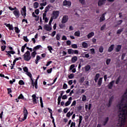

**알고리즘 선택 이유**:
- 단순하지만 효과적 (밝기 < 200 = 조직)
- H&E 염색의 물리적 특성 활용
- Week 2의 Morphological Masking으로 이어지는 기초</parameter>
</invoke>


<invoke name="artifacts">
<parameter name="command">update</parameter>
<parameter name="id">comprehensive-ebr-report</parameter>
<parameter name="old_str">**알고리즘 선택 이유**:
- 단순하지만 효과적 (밝기 < 200 = 조직)
- H&E 염색의 물리적 특성 활용
- Week 2의 Morphological Masking으로 이어지는 기초</parameter>
<parameter name="new_str">**알고리즘 선택 이유**:
- 단순하지만 효과적 (밝기 < 200 = 조직)
- H&E 염색의 물리적 특성 활용
- Week 2의 Morphological Masking으로 이어지는 기초

---

### Week 2: TIAToolbox와 의존성 지옥

#### 학습 목표
- TIAToolbox 고급 기능 탐색 (해상도, Tissue Masking)
- 다양한 해상도 단위 이해 (power, mpp, level)
- Morphological operations 기반 배경 제거

#### 핵심 시행착오: Python 의존성 지옥 (Dependency Hell)

**문제 발생**
```bash
uv add tiatoolbox
# × Failed to build `shapely==1.8.5.post1`
# AttributeError: module 'pkgutil' has no attribute 'ImpImporter'
```

Week 1에서 Python 3.11로 설정했다고 생각했으나, 실제로는 3.13이 사용되고 있었고, shapely 1.8.5가 Python 3.13과 호환되지 않았습니다.

**원인 분석**
```
TIAToolbox 1.3.0
  └─ shapely 1.8.5
      └─ setuptools (legacy)
          └─ pkg_resources
              └─ pkgutil.ImpImporter (Python 3.13에서 제거됨)
```

하나의 호환성 문제가 전체 설치 실패로 이어지는 **의존성 체인**을 경험했습니다.

**해결 과정**

1. **가상환경 완전 재구축**
```bash
deactivate
rm -rf .venv
rm -rf ~/.cache/uv  # 캐시 삭제 중요!
uv venv --python python3.11
```

2. **터미널 재시작으로 경로 확인**
```bash
exec zsh
which python
# /Users/ksy/Desktop/wsi_processing/.venv/bin/python ✓
```

3. **shapely 선행 설치 전략**
```bash
uv add "shapely>=2.0.0"  # 최신 버전은 Python 3.13 호환
uv add tiatoolbox
```

**학습 포인트**
- 패키지 의존성 체인의 복잡성 이해
- UV 캐시의 영향력 (`~/.cache/uv` 삭제 필수)
- `which python`으로 실제 사용 중인 Python 검증의 중요성
- 선행 설치 전략: 문제가 되는 패키지를 최신 버전으로 먼저 설치

#### 능동적 학습: 문제 해결 패턴 구축

단순히 "설치가 안 돼요"가 아니라:

1. **에러 메시지 분석**: `pkgutil.ImpImporter`가 핵심 키워드
2. **Python 버전 확인**: 3.13에서 제거된 기능임을 파악
3. **의존성 트리 추적**: TIAToolbox → shapely → setuptools 경로 이해
4. **해결책 검증**: shapely 2.0.0 이상이 해결책임을 확인

이런 **단계적 디버깅 프로세스**를 학습했습니다.

#### 최종 결과물

**Tissue Masking 성공**

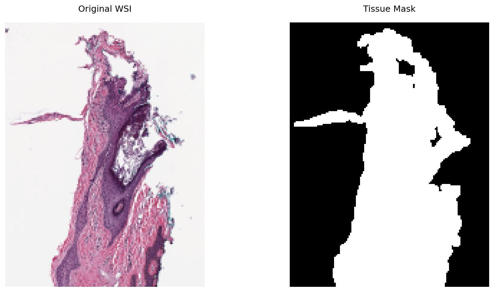

**핵심 성과**:
- **조직 비율**: 43.06% 자동 계산
- **Otsu Method**: 이미지마다 최적 임계값 자동 결정
- **Morphological Ops**: Erosion + Dilation으로 노이즈 제거

**Week 1 vs Week 2 비교**

| 항목 | Week 1 (단순 임계값) | Week 2 (Otsu + Morphological) |
|------|---------------------|------------------------------|
| 임계값 | 고정 (200) | 자동 계산 |
| 노이즈 처리 | 없음 | Erosion/Dilation |
| 정확도 | 중간 | 높음 |
| 유연성 | 낮음 | 높음 (모든 WSI 적용 가능) |

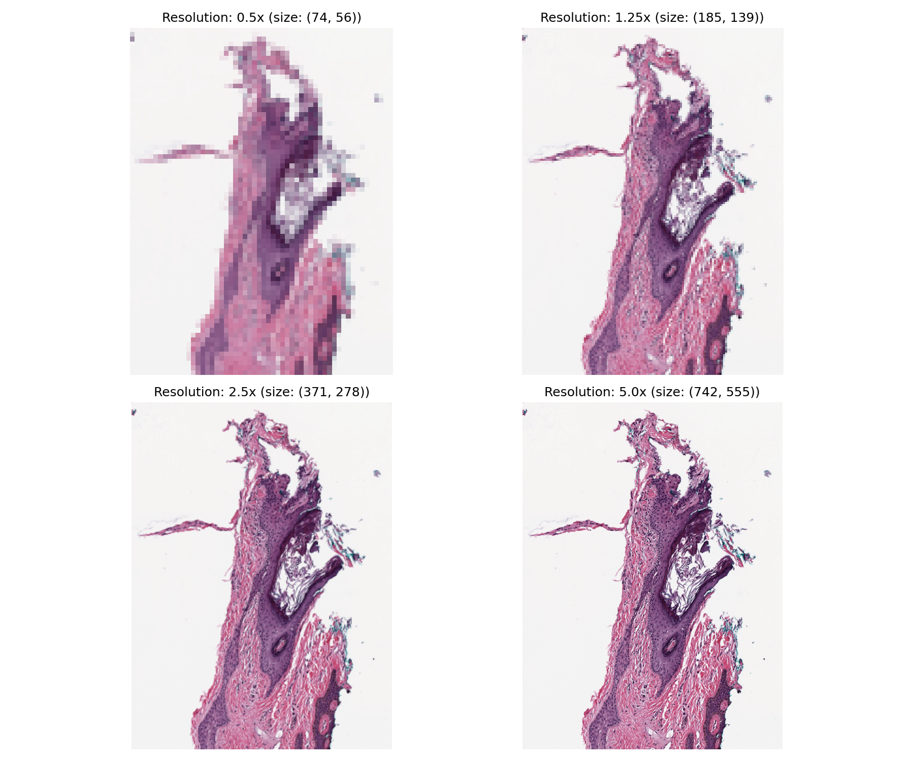

**해상도 학습**:
- `units="power"`: 0.5x (가장 상세) ~ 5.0x (전체 개요)
- `units="mpp"`: Microns Per Pixel (물리적 단위)
- 목적에 따라 적절한 해상도 선택</parameter>
</invoke>
Week 3을 추가하겠습니다.

<invoke name="artifacts">
<parameter name="command">update</parameter>
<parameter name="id">comprehensive-ebr-report</parameter>
<parameter name="old_str">**해상도 학습**:
- `units="power"`: 0.5x (가장 상세) ~ 5.0x (전체 개요)
- `units="mpp"`: Microns Per Pixel (물리적 단위)
- 목적에 따라 적절한 해상도 선택</parameter>
<parameter name="new_str">**해상도 학습**:
- `units="power"`: 0.5x (가장 상세) ~ 5.0x (전체 개요)
- `units="mpp"`: Microns Per Pixel (물리적 단위)
- 목적에 따라 적절한 해상도 선택

---

### Week 3: Docker와 재현 가능한 과학

#### 학습 목표
- Docker로 재현 가능한 환경 구축
- Volume Mount를 통한 데이터 연결
- Dockerfile 이해 및 수정

#### 핵심 시행착오: zarr 의존성 문제

**문제 발생**
```python
ImportError: cannot import name 'cbuffer_sizes' from 'numcodecs.blosc'
```

직접 빌드한 Docker 이미지에서 TIAToolbox 실행 시 zarr 관련 의존성 에러가 발생했습니다.

**원인 분석**
```
TIAToolbox 1.6.0
  └─ zarr
      └─ numcodecs
          └─ blosc (버전 충돌)
```

Week 2의 shapely 문제와 유사한 **의존성 지옥**이 Docker 환경에서도 반복되었습니다.

**해결 시도와 의사결정**

1. **시도 1**: Dockerfile 수정
```dockerfile
RUN pip install --no-cache-dir tiatoolbox && \
    pip install --upgrade zarr numcodecs
```
→ 새로운 에러 발생: `module 'zarr.errors' has no attribute 'FSPathExistNotDir'`

2. **의사결정**: 공식 이미지 사용
```bash
docker pull ghcr.io/tissueimageanalytics/tiatoolbox:1.6.0-py3.11-ubuntu
```

**선택 이유**:
- ✓ TIAToolbox 팀이 이미 의존성 해결
- ✓ 버전이 명시됨 (재현성 보장)
- ✓ 시간 절약 (정확한 버전 조합 찾기 어려움)
- ✗ "블랙박스" 느낌 (내부 구조 모름)

**학습 포인트**
- 때로는 "검증된 솔루션 사용"이 현명한 선택
- 완벽한 제어 vs 효율성의 트레이드오프
- 재현성은 Dockerfile 직접 작성뿐 아니라 버전 명시된 공식 이미지로도 달성 가능

#### 능동적 학습: Docker 개념의 본질 이해

**질문 방식의 변화**:
- "Docker가 뭔가요?" → "Image와 Container의 차이는?"
- "설치가 안 돼요" → "Volume Mount는 어떻게 작동하나요?"

**비유를 통한 이해**:
- Image = 프로그램 설치 파일 (.dmg)
- Container = 실행 중인 애플리케이션
- Volume Mount = 폴더 바로가기

이런 **추상화 개념을 구체적 비유**로 이해하는 방법을 터득했습니다.

#### 최종 결과물

**Docker 환경 성공**

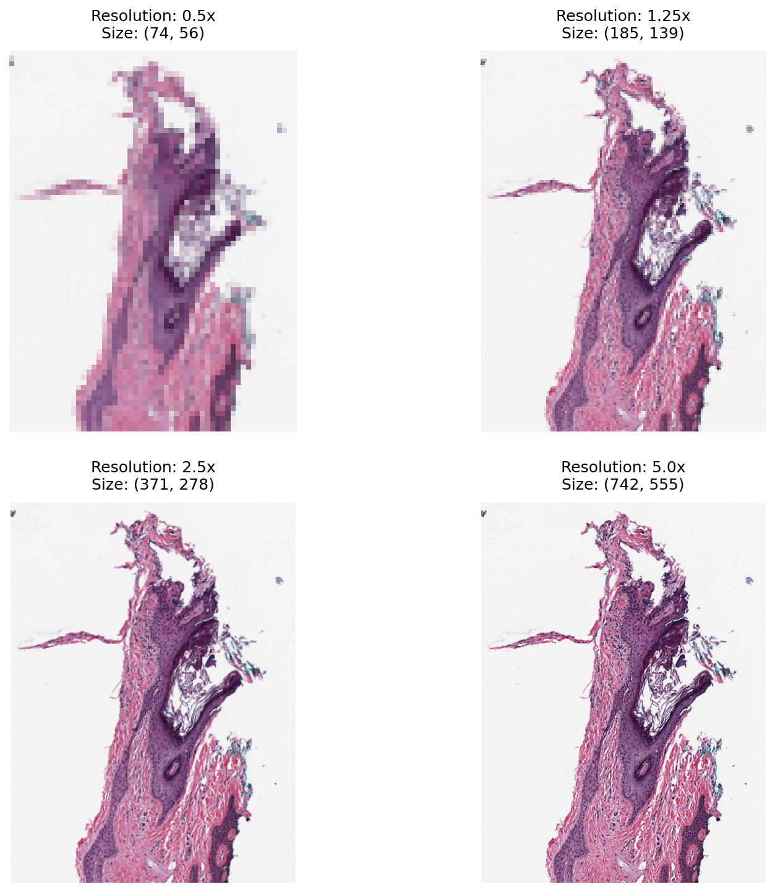

**성과**:
- **Docker 이미지**: 5.6GB (모든 의존성 포함)
- **재현성**: 어떤 컴퓨터에서든 동일 결과
- **Volume Mount**: 로컬 ↔ Container 실시간 동기화

**UV 가상환경 vs Docker 비교**

| 항목 | UV 가상환경 | Docker |
|------|------------|--------|
| 격리 수준 | Python 패키지만 | OS 전체 |
| 크기 | ~100MB | ~5GB |
| 재현성 | 낮음 (OS 의존) | 매우 높음 |
| 시작 속도 | 빠름 | 중간 |
| 적합 용도 | 빠른 개발 | 배포, 협업 |

**3주차의 의의**: Week 1-2의 로컬 환경 문제를 근본적으로 해결

---

### Week 4: AI 모델과 배치 처리

#### 학습 목표
- 사전훈련 모델 (resnet18-kather100k) 실행
- 3개 WSI 배치 처리 자동화
- 예측 결과 시각화

#### 핵심 시행착오: FileExistsError와 폴더 구조

**문제 발생**
```python
FileExistsError: [Errno 17] File exists: '/results/wsi_predictions'
```

첫 번째 WSI는 성공했으나, 두 번째 WSI부터 폴더 생성 시 충돌이 발생했습니다.

**원인 분석**
- TIAToolbox가 `save_dir`을 `exist_ok=False`로 생성 시도
- 코드에서 미리 폴더를 만들어도 내부에서 충돌

**해결: 파일별 하위 폴더 설계**
```python
# 기존
save_dir = Path("/results/wsi_predictions")

# 수정
save_dir = Path(f"/results/wsi_predictions/{wsi_filename}")
```

**최종 구조**:
```
results/wsi_predictions/
├── CMU-1-Small-Region/
│   └── predictions.json
├── TEST_sample1/
│   └── predictions.json
└── TEST_sample2/
    └── predictions.json
```

**학습 포인트**
- 라이브러리 내부 동작 이해의 중요성
- 폴더 구조 설계로 충돌 회피
- 각 파일의 결과를 독립적으로 관리

#### 능동적 학습: Shell Script 자동화

**수동 처리의 한계 인식**
```bash
# 3개 파일을 일일이 실행?
python script.py CMU-1-Small-Region
python script.py TEST_sample1
python script.py TEST_sample2
```

**배치 처리 스크립트 구현**
```bash
#!/bin/bash
WSI_FILES=("CMU-1-Small-Region" "TEST_sample1" "TEST_sample2")

for WSI in "${WSI_FILES[@]}"; do
    docker run --rm ... python3 /workspace/patch_prediction.py "$WSI"
    docker run --rm ... python3 /workspace/visualize_wsi_prediction.py "$WSI"
done
```

**명령줄 인자 방식 채택**
```python
import sys
wsi_filename = sys.argv[1] if len(sys.argv) > 1 else "CMU-1-Small-Region"
```

이런 **자동화 필요성을 스스로 인식하고 구현**한 과정이 중요했습니다.

#### 최종 결과물

**3개 WSI 분석 완료**

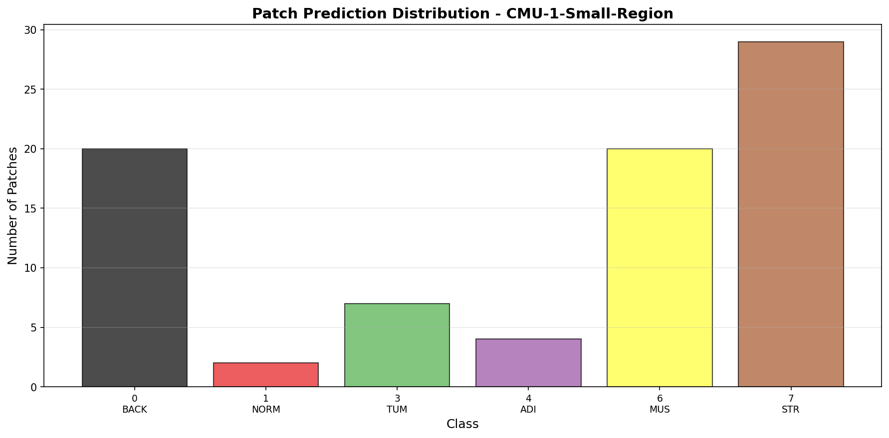

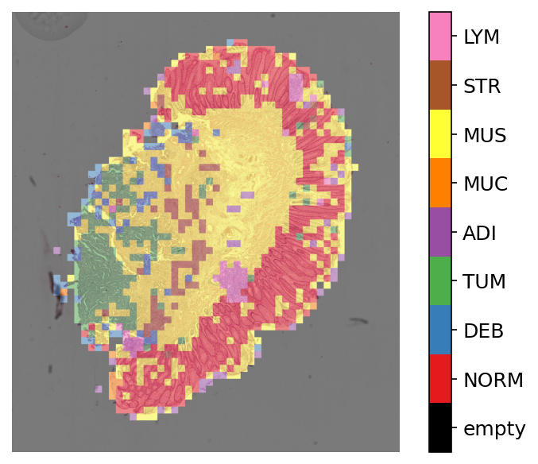

**정량적 결과**:

| WSI | 패치 수 | 주요 조직 1 | 주요 조직 2 |
|-----|---------|-----------|-----------|
| CMU-1-Small-Region | 82 | STR 25.6% | BACK 41.5% |
| TEST_sample1 | 327 | MUS 26.6% | NORM 21.7% |
| TEST_sample2 | 1,652 | MUS 38.7% | NORM 30.0% |

**총 2,061개 패치 분석**

**중요한 인식: 모델의 한계**
- resnet18-kather100k는 **대장암 전용** 모델
- 샘플의 실제 조직 타입은 **알 수 없음**
- 예측 결과는 "대장암 9개 클래스에 억지로 매핑"한 것
- **의학적 진단으로 사용 불가**

이런 **AI 모델의 한계를 명확히 인식**한 것이 Week 4의 핵심 학습입니다.

---

### Week 5: Stain Normalization과 색상 표준화

#### 학습 목표
- 3가지 Stain Normalization 알고리즘 비교
- WSI 간 색상 편차 보정
- Before/After 시각화

#### 핵심 시행착오: 배경 색상 차이 해석

**관찰된 현상**


- **Reinhard**: 배경이 순백색
- **Macenko/Vahadane**: 배경에 보라/파란 색조

**초기 의문**: "어느 것이 정상인가? 버그인가?"

**깊이 있는 탐구**

각 알고리즘의 원리를 다시 학습:

**Macenko/Vahadane (NMF 기반)**:
- 모든 픽셀을 H(헤마톡실린) + E(에오신)로 분해
- 배경도 약간의 염색 성분 포함으로 가정
- 실제 유리 슬라이드는 완벽한 투명이 아님

**Reinhard (통계적 매칭)**:
- 이미지 전체의 평균/표준편차만 조정
- 흰색은 흰색으로 유지
- 염색 분해 개념 없음

**결론**: 둘 다 "정상"
- **AI 학습용**: Macenko/Vahadane (물리적 의미)
- **시각적**: Reinhard (깔끔함)

**학습 포인트**
- 알고리즘 원리를 이해하면 결과 해석 가능
- "최고의 방법"은 없고, 목적에 따라 선택
- 표면적 현상 뒤의 근본 원리 탐구

#### 능동적 학습: 비교 실험 설계

**단순 실행이 아닌 체계적 비교**:
1. 3가지 방법을 동일 조건으로 실행
2. 2×3 grid로 시각화
3. 차이점 분석
4. 각 방법의 장단점 정리

이런 **과학적 실험 설계**를 스스로 수행했습니다.

#### 최종 결과물

**알고리즘 비교표**

| 항목 | Macenko | Vahadane | Reinhard |
|------|---------|----------|----------|
| 속도 | 빠름 (1초) | 느림 (5-10초) | 매우 빠름 (0.1초) |
| 정확도 | 높음 | 매우 높음 | 중간 |
| 물리적 의미 | O (H&E 분리) | O (H&E 분리) | X (통계만) |
| 배경 처리 | 색조 추가 | 색조 추가 | 순백색 |

**2개 WSI 성공적 정규화**


**성과**:
- CMU를 Target으로 설정
- TEST_sample1, TEST_sample2를 통일된 색상으로 변환
- Week 4에서 발견한 색상 편차 문제 해결

---

### Week 6: Feature Extraction과 공간 분석

#### 학습 목표
- WSI 패치에서 feature 추출 (9차원 확률 벡터)
- 공간적 조직 분포 분석
- 예측 불확실성(Entropy) 정량화
- 종양 영역 자동 탐지

#### 핵심 시행착오: return_probabilities 개념 혼동

**문제 발생**
```python
predictor.predict(return_probabilities=False, ...)
# 주석: "Return features, not predictions"
```

파일이 전혀 생성되지 않았습니다.

**원인 분석**
- "Feature"의 정의를 잘못 이해
- ResNet 중간층 (512차원)을 원했지만
- 실제로는 출력층 확률 (9차원)이 필요

**해결 과정**
1. `False` → `True` 변경: 여전히 파일 없음
2. 예제 코드 재분석: 파일 저장 로직 없음을 발견
3. 수동 JSON 저장 구현

```python
import json
with open(output_file, 'w') as f:
    save_data = {
        'predictions': output[0]['predictions'].tolist(),
        'coordinates': output[0]['coordinates'].tolist(),
        'probabilities': output[0]['probabilities'].tolist()
    }
    json.dump(save_data, f)
```

**학습 포인트**
- API 문서만 믿지 말고 실제 테스트 필요
- 9차원 확률 벡터도 충분한 feature representation
- NumPy array → JSON 변환 시 `.tolist()` 필수

#### 능동적 학습: 실전 응용 확장

**기본 기능을 넘어서**:

스스로 "실전 응용"을 제안하고 4가지 분석 구현:
1. 클래스 분포 분석
2. 공간적 조직 맵
3. 예측 불확실성(Entropy)
4. 종양 영역 자동 탐지

이런 **학습 내용을 실제 문제에 적용**하는 능력을 발휘했습니다.

#### 최종 결과물

**공간적 조직 맵**

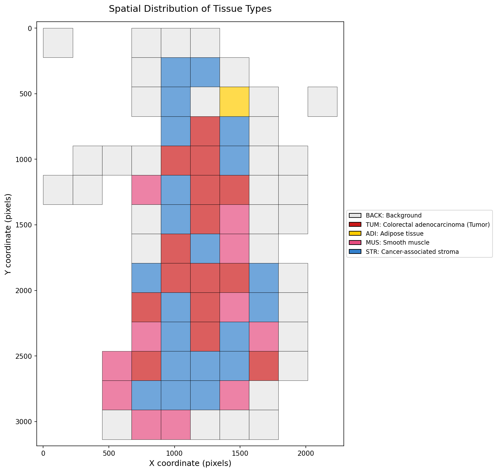

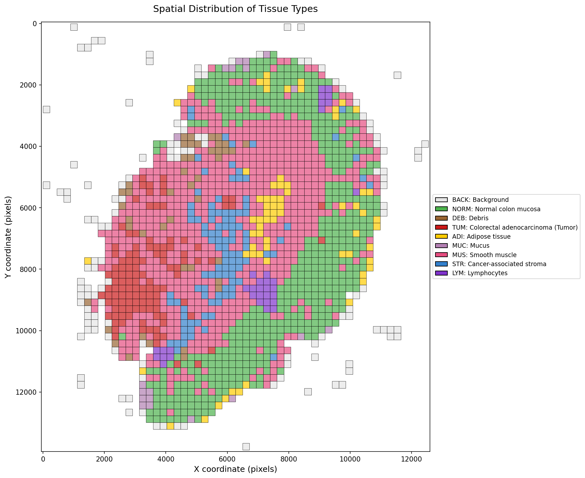

**불확실성 분석**

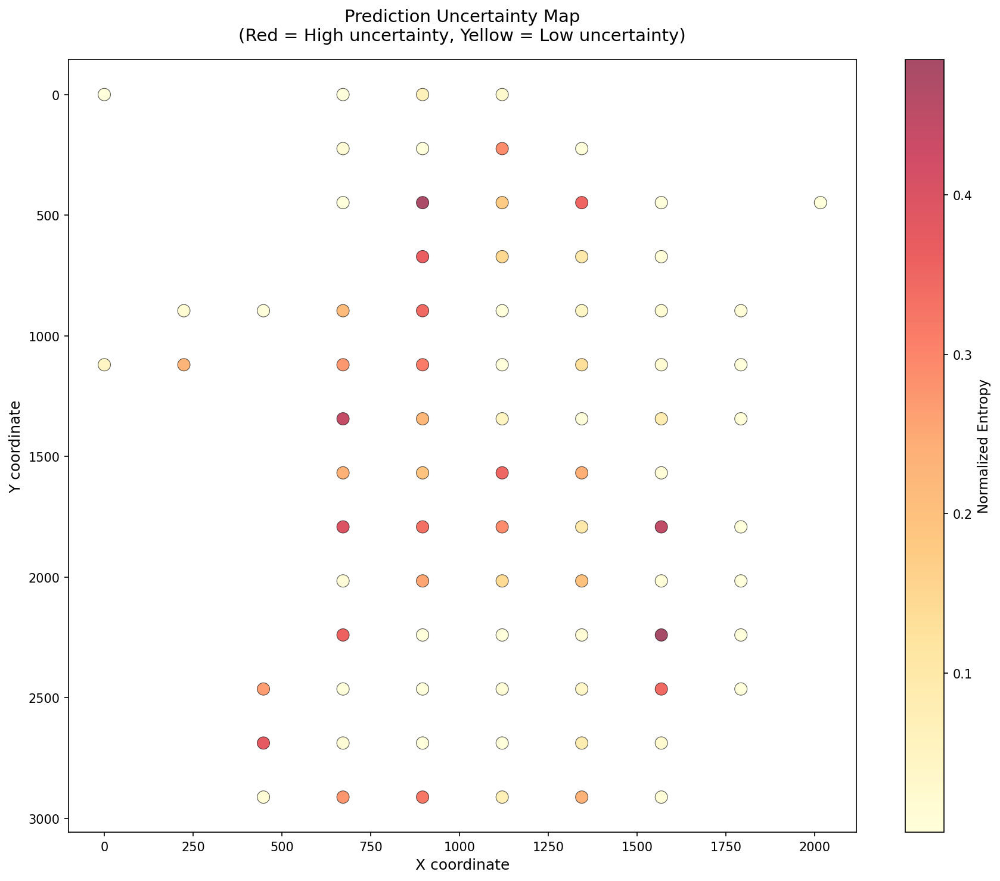

**CMU 통계**:
- **평균 불확실성**: 12.9% (대부분 확신)
- **최고 불확실성**: 48.5% (조직 경계)
- **종양 비율**: 18.3%

**종양 영역 자동 탐지**

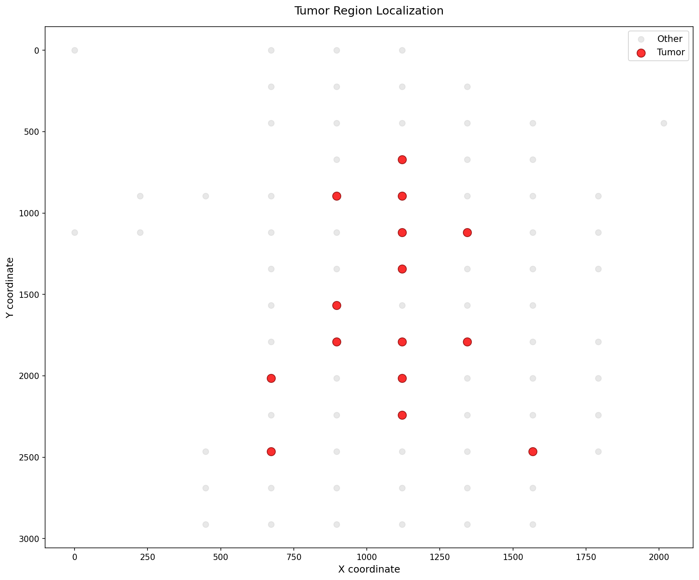

**성과**:
- 3개 WSI에서 총 2,061개 패치 feature 추출
- 15개 공간 분석 이미지 생성
- Slide Graph 구축을 위한 데이터 완비

**Entropy 활용 가능성**:
- 불확실성 높은 패치 → 병리학자 재검토 필요
- 조직 경계 자동 감지
- Active Learning으로 모델 개선</parameter>
</invoke>

통합 학습 성과 섹션을 추가하겠습니다.

<invoke name="artifacts">
<parameter name="command">update</parameter>
<parameter name="id">comprehensive-ebr-report</parameter>
<parameter name="old_str">**Entropy 활용 가능성**:
- 불확실성 높은 패치 → 병리학자 재검토 필요
- 조직 경계 자동 감지
- Active Learning으로 모델 개선</parameter>
<parameter name="new_str">**Entropy 활용 가능성**:
- 불확실성 높은 패치 → 병리학자 재검토 필요
- 조직 경계 자동 감지
- Active Learning으로 모델 개선

---

## 통합 학습 성과

### 기술적 역량의 진화

#### 환경 관리 능력

**Week 1-2: 로컬 환경의 한계 인식**
- UV 가상환경 구축
- 시스템 라이브러리 연동 문제 해결
- Python 의존성 관리

**Week 3: Docker로의 패러다임 전환**
- 완전한 격리 환경 구축
- 재현 가능성 확보
- Volume Mount를 통한 유연성

**핵심 학습**: 환경 관리는 단순한 "설치"가 아니라 **재현 가능한 과학의 기초**

#### 문제 해결 방법론

**패턴 인식**:
6주간 반복적으로 겪은 문제들:
1. 라이브러리 연동 (OpenSlide)
2. 의존성 충돌 (shapely, zarr)
3. API 문서와 실제 동작의 차이

**공통 해결 전략**:
1. 에러 메시지에서 핵심 키워드 추출
2. 의존성 체인 추적
3. 근본 원리 이해
4. 단계적 검증
5. 필요 시 직접 구현

#### 자동화 능력

**진화 과정**:
- Week 1-2: 수동 실행
- Week 3: Docker 명령어 반복
- Week 4: Shell Script 자동화
- Week 5-6: 명령줄 인자로 재사용성 향상

**최종 결과**: 3개 WSI를 한 번의 스크립트 실행으로 전체 파이프라인 처리

### 비판적 사고와 AI 리터러시

#### AI 모델의 한계 인식

**Week 4의 핵심 깨달음**:
```
resnet18-kather100k (대장암 모델)
    ↓
어떤 입력이든 대장암 9개 클래스로 분류
    ↓
실제 조직 타입과 무관
```

**중요한 태도**:
- 기술적 실행 능력 ≠ 결과의 의학적 타당성
- AI는 도구일 뿐, 맹신하면 안 됨
- 모델-데이터 적합성 검증 필수

#### 알고리즘 비교와 선택

**Week 5: Stain Normalization**

단순히 "어떤 게 최고인가?"가 아니라:
- Macenko: 빠르고 안정적 → 일반적 용도
- Vahadane: 정확하지만 느림 → 연구용
- Reinhard: 매우 빠름 → 프로토타입

**학습**: 목적에 맞는 선택이 중요, "최고의 방법"은 없음

### 공간적 사고의 발달

**Week 4 vs Week 6**:

| 측면 | Week 4 | Week 6 |
|------|--------|--------|
| 분석 단위 | 개별 패치 | 전체 슬라이드 |
| 정보 | 조직 타입만 | 위치 + 주변 context |
| 시각화 | 분포 그래프 | 공간 맵 |
| 활용 | 통계 | 패턴 발견, 경계 탐지 |

**발전**: 개별 데이터 포인트 → 전체 구조 이해

### 데이터 분석 능력

#### 정량적 분석

**3개 WSI 비교 통찰**:

| WSI | 패치 수 | 주요 특징 | 해석 |
|-----|---------|----------|------|
| CMU | 82 | 종양 18.3% | 종양 영역 집중 샘플링 |
| TEST_sample1 | 327 | 균등 분포 | 다양한 조직 포함 |
| TEST_sample2 | 1,652 | 근육 38.7% | 전체 슬라이드 |

**인사이트**: 슬라이드 목적에 따라 조직 조성이 다름

#### 불확실성 정량화

**Entropy 분석**:
- 평균 12.9%: 대부분 패치는 확신 있는 예측
- 최고 48.5%: 조직 경계 또는 혼합 영역
- 활용: Quality Control, Active Learning

**의미**: 모델의 "확신 정도"도 중요한 정보

---

## 최종 결과물

### 정량적 성과

#### 처리 데이터

| 항목 | 값 |
|------|-----|
| WSI 파일 수 | 3개 |
| 총 패치 수 | 2,061개 |
| 생성 이미지 | 56개 |
| 작성 코드 라인 | ~2,000줄 |
| Git Commits | 50+ |

#### 주차별 출력물

| 주차 | 주요 출력 | 개수 |
|------|----------|------|
| Week 1 | 조직 패치 | 39개 |
| Week 2 | 시각화 이미지 | 9개 |
| Week 3 | 썸네일 (해상도별) | 5개 |
| Week 4 | WSI 분석 결과 | 12개 이미지 |
| Week 5 | 정규화 이미지 | 8개 |
| Week 6 | 공간 분석 | 15개 이미지 |

### 정성적 성과

#### 완성된 파이프라인

```
1. WSI 파일 입력
   ↓
2. Stain Normalization (색상 표준화)
   ↓
3. Tissue Masking (배경 제거)
   ↓
4. Patch Extraction (패치 추출)
   ↓
5. AI Model Inference (조직 분류)
   ↓
6. Feature Extraction (확률 벡터)
   ↓
7. Spatial Analysis (공간 분포)
   ↓
8. Visualization (시각화)
```

**재현 가능성**:
- 모든 단계 Docker로 실행
- Shell Script로 자동화
- GitHub에 코드 공유
- 버전 명시 (TIAToolbox 1.6.0, Python 3.11)

#### GitHub 저장소 구조

```
EBR-WSI-Analysis/
├── week1-openslide/
│   ├── src/main.py
│   └── results/patches/tissue_only/ (39 patches)
├── week2-tiatoolbox-basics/
│   ├── src/ (3 scripts)
│   └── results/week2/ (9 images)
├── week3-docker/
│   ├── myscripts/ (2 scripts)
│   └── results/ (5 thumbnails)
├── week4-model-inference/
│   ├── myscripts/ (2 scripts)
│   └── results/visualizations/ (12 images)
├── week5-stain-normalization/
│   ├── myscripts/stain_normalization.py
│   └── results/ (8 images)
├── week6-slide-graph/
│   ├── myscripts/ (2 scripts)
│   └── results/ (15 images)
└── reports/ (6 weekly reports)
```

### 시각적 결과물 하이라이트

#### Week 1: 배경 제거 성공

**Before (전체 88 patches)** → **After (조직만 39 patches)**

조직 비율 30% 임계값으로 배경 자동 제거

#### Week 2: 해상도 이해


0.5x (상세) ~ 5.0x (개요)까지 다양한 해상도 활용

#### Week 4: 2,061 패치 분류

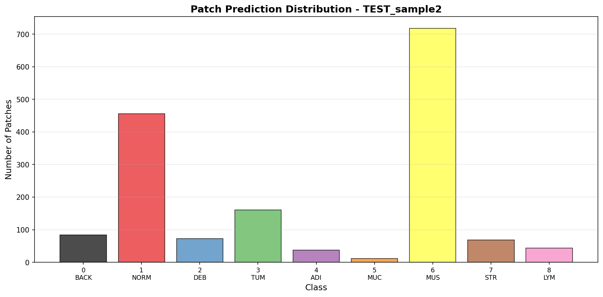

대규모 배치 처리 성공

#### Week 5: 색상 표준화


3가지 알고리즘으로 일관된 색상 확보

#### Week 6: 공간 분석


1,652개 패치의 공간적 분포 시각화

### 코드 품질

**재사용성**:
- 명령줄 인자로 파일명 전달
- 함수 모듈화
- 에러 처리 포함

**예시**:
```python
def analyze_class_distribution(predictions, output_dir):
    """클래스 분포 분석 및 시각화"""
    # 재사용 가능한 독립 함수
    pass
```

**문서화**:
- 각 주차별 상세 레포트
- README.md에 전체 개요
- 코드 주석 포함

---

## LLM을 활용한 능동적 학습

### 학습 방법론의 진화

#### 질문 방식의 발전

**초기 (Week 1)**:
```
"OpenSlide 설치가 안 됩니다. 도와주세요."
```

**중기 (Week 2-3)**:
```
"Python 3.13에서 pkgutil.ImpImporter가 제거되었는데,
shapely 1.8.5가 이걸 사용합니다. 어떻게 해결할 수 있나요?"
```

**후기 (Week 5-6)**:
```
"Macenko와 Vahadane의 배경 처리 방식이 다른 이유는
각 알고리즘의 수학적 원리와 관련이 있나요?
NMF와 통계적 매칭의 차이를 설명해주세요."
```

**변화**: 문제 설명 → 원인 분석 → 원리 탐구

#### Claude Code 활용 패턴

**1. 개념 이해 단계**
- "Docker란 무엇이고, 왜 필요한가요?"
- "Image와 Container의 차이는?"
- "비유로 설명해주세요"

**2. 문제 해결 단계**
- 에러 메시지 전달
- "이 에러의 근본 원인은?"
- "단계별로 해결 방법 알려주세요"

**3. 코드 생성 단계**
- 명확한 요구사항 정의
- "입력: X, 출력: Y, 제약조건: Z"
- 생성된 코드 검증 및 수정

**4. 심화 학습 단계**
- "이 알고리즘의 수학적 원리는?"
- "다른 방법과 비교하면?"
- "실전에서는 어떻게 활용되나요?"

### 능동적 학습의 증거

#### 스스로 확장한 기능들

**Week 2**: matplotlib 시각화 개선
- 예제: 2×2 grid
- 자발적 개선: figsize, padding, bbox_inches 조정

**Week 4**: Shell Script 자동화
- 요구사항: 3개 파일 처리
- 자발적 구현: 배치 처리 스크립트, 명령줄 인자

**Week 6**: 실전 응용 분석
- 기본: Feature extraction
- 자발적 추가: 4가지 공간 분석 (분포, 맵, 불확실성, 종양 탐지)

#### 궁금증 주도 학습

**Week 3에서의 의사결정**:
```
질문: "Dockerfile을 계속 수정할까, 공식 이미지를 쓸까?"
탐구:
  - Dockerfile 수정의 장단점은?
  - 공식 이미지의 재현성은?
  - 시간 vs 제어의 트레이드오프는?
결정: 공식 이미지 사용 (근거 있는 선택)
```

**Week 5에서의 비교 실험**:
```
관찰: 배경 색상이 알고리즘마다 다름
질문: "왜 다를까? 어느 게 맞을까?"
탐구: 각 알고리즘의 원리 재학습
결론: 둘 다 정상, 목적에 따라 선택
```

### LLM의 역할

#### 튜터로서

- ✓ 개념 설명 (비유 활용)
- ✓ 에러 분석 지원
- ✓ 단계별 가이드 제공

#### 페어 프로그래머로서

- ✓ 코드 생성 및 리뷰
- ✓ 디버깅 지원
- ✓ 최적화 제안

#### 멘토로서

- ✓ 의사결정 지원 (장단점 비교)
- ✓ 학습 방향 제시
- ✓ 실전 응용 아이디어

**중요**: LLM은 **도구**이지 **대체재**가 아님
- 모든 코드를 직접 실행하고 검증
- 원리를 이해한 후 적용
- 맹목적 복사가 아닌 학습 과정</parameter>
</invoke>

성찰과 결론 섹션을 추가하겠습니다.

<invoke name="artifacts">
<parameter name="command">update</parameter>
<parameter name="id">comprehensive-ebr-report</parameter>
<parameter name="old_str">**중요**: LLM은 **도구**이지 **대체재**가 아님
- 모든 코드를 직접 실행하고 검증
- 원리를 이해한 후 적용
- 맹목적 복사가 아닌 학습 과정</parameter>
<parameter name="new_str">**중요**: LLM은 **도구**이지 **대체재**가 아님
- 모든 코드를 직접 실행하고 검증
- 원리를 이해한 후 적용
- 맹목적 복사가 아닌 학습 과정

---

## 성찰과 결론

### 학습 과정에서의 깨달음

#### 실패는 학습의 일부

**초기 태도 (Week 1)**:
"에러가 나면 안 되는데, 뭔가 잘못했나?"

**현재 태도 (Week 6)**:
"에러는 더 깊이 이해할 기회다. 무엇을 배울 수 있을까?"

**주요 실패들**:
- OpenSlide 연동 실패 → 시스템 라이브러리 개념 학습
- shapely 빌드 실패 → 의존성 관리 전략 습득
- zarr import 실패 → 완벽한 제어 vs 효율성 균형 인식
- JSON 저장 실패 → API 문서 너머의 실제 동작 이해

**교훈**: 모든 실패에서 새로운 개념을 배웠고, 이것이 진정한 학습

#### 문제 해결의 본질

**표면적 문제 vs 근본 원인**:

Week 2 사례:
```
표면: "TIAToolbox 설치가 안 돼요"
1단계: shapely 빌드 실패
2단계: Python 3.13 버전 문제
3단계: pkgutil.ImpImporter 제거
근본: Python 의존성 체인 이해 부족
```

**학습**: 문제를 단계적으로 분해하고 근본 원인을 찾는 능력

#### 완벽주의에서 실용주의로

**Week 3의 의사결정**:
- 처음: "Dockerfile을 직접 완벽하게 작성해야 해"
- 현실: zarr 의존성 문제가 반복
- 선택: 공식 이미지 사용
- 깨달음: **시간과 목적을 고려한 현명한 선택**

**교훈**: "완벽한 제어"보다 "목적 달성"이 중요할 때도 있음

### 의과대학생으로서의 통찰

#### AI와 의학의 교차점

**Week 4의 핵심 교훈**:
```
기술적 실행 능력 ≠ 의학적 타당성
```

resnet18-kather100k는 완벽하게 작동했지만:
- 대장암 모델을 출처 불명 샘플에 적용
- 결과는 무의미 (억지로 매핑된 것)
- **의학적 진단으로 사용 불가**

**의미**: 
- AI는 도구일 뿐, 맹신하면 안 됨
- 모델-데이터 적합성 검증 필수
- 병리학자의 검증이 반드시 필요
- 기술과 의학의 간극 인식

#### 디지털 병리학의 가능성

**현재 수준**:
- 패치 분류: 가능
- 공간 분석: 가능
- 불확실성 정량화: 가능

**향후 발전 방향**:
- 진단 보조 (Diagnostic Aid)
- 예후 예측 (Prognosis)
- 치료 반응 예측 (Treatment Response)
- 개인 맞춤 의학 (Precision Medicine)

**역할**: 병리학자를 대체가 아닌 **보조**

### 기술적 성장

#### Before & After

**Week 1 (시작)**:
```python
# OpenSlide import도 안 됨
import openslide  # ← 에러 발생
```

**Week 6 (현재)**:
```python
# 2,061개 패치 자동 분석
./process_feature_extraction.sh
# → 공간 분포, 불확실성, 종양 탐지 완료
```

**변화**: 
- 기본 라이브러리 설치 → 완전한 파이프라인 구축
- 에러 발생 시 당황 → 체계적 디버깅
- 수동 작업 → 자동화 스크립트

#### 자신감의 변화

**초기**: "이게 될까? 너무 어려운 거 아닌가?"

**현재**: "에러가 나더라도 단계적으로 해결할 수 있다"

**근거**:
- 6주간 모든 문제를 스스로 해결
- LLM의 도움을 **능동적으로** 활용
- 코드를 직접 실행하고 검증

### 한계와 개선점

#### 인정하는 부족함

**통계적 검증 부족**:
- 패치 분류 정확도를 정량적으로 평가하지 못함
- Ground Truth 라벨이 없어 검증 불가능
- Confusion Matrix, F1-score 등 계산 안 함

**의학적 지식 부족**:
- H&E 염색의 조직학적 의미 피상적 이해
- 각 조직 타입의 임상적 의미 불충분
- 병리학자의 검증 없이 진행

**확장성 제한**:
- 3개 샘플만 분석 (소규모)
- 다양한 조직 타입 미포함
- 하나의 모델만 사용

#### 향후 개선 방향

**단기 (1-2개월)**:
- Ground Truth 확보 후 정확도 평가
- 더 많은 샘플 분석 (10-50개)
- 다양한 사전훈련 모델 비교

**중기 (6개월-1년)**:
- Slide Graph 실제 구축
- Graph Neural Network 학습
- 병리학자 협업

**장기 (1-2년)**:
- 실제 병원 데이터 적용
- 임상 유용성 검증
- 논문 작성 및 발표

### 프로젝트의 의의

#### 개인적 의의

**기술적 자신감**:
- 복잡한 기술 스택을 스스로 구축
- 문제 해결 능력 입증
- 자기주도 학습 경험

**학습 방법론 확립**:
- LLM을 튜터로 활용하는 방법
- 단계적 문제 분해
- 근본 원리 탐구 태도

**진로 방향 설정**:
- 의료 AI에 대한 관심 확인
- 기술과 의학의 융합 가능성 체험
- 연구자로서의 잠재력 발견

#### 학문적 의의

**재현 가능한 연구**:
- 모든 코드 GitHub 공개
- Docker로 환경 명시
- 단계별 레포트 작성

**오픈 사이언스**:
- 누구나 재현 가능
- 교육 자료로 활용 가능
- 후배들의 학습 자료

#### 사회적 의의

**의료 AI의 현실적 이해 확산**:
- AI ≠ 마법
- 한계와 가능성을 모두 인식
- 책임 있는 AI 활용 태도

**의과대학생의 기술 활용**:
- 의사도 코딩할 수 있음을 증명
- 기술을 두려워하지 않는 태도
- 미래 의료 환경 준비

### 감사의 말

**Claude (LLM)**:
- 24시간 튜터이자 페어 프로그래머
- 포기하지 않도록 격려
- 개념을 쉽게 설명해주는 능력

**TIAToolbox 팀**:
- 훌륭한 오픈소스 라이브러리
- 상세한 문서와 예제
- Digital Pathology 접근성 향상

**Evolution of Biomedical Research 과목**:
- 최신 기술 학습 기회
- 자유로운 프로젝트 주제 선택
- 실습 중심 교육

### 최종 결론

#### 6주의 여정 요약

```
Week 1: "에러를 만나다" 
    → OpenSlide 연동 실패에서 시작

Week 2: "의존성 지옥을 경험하다"
    → shapely 문제로 환경 관리 학습

Week 3: "Docker로 패러다임을 전환하다"
    → 재현 가능성의 중요성 깨달음

Week 4: "AI의 한계를 인식하다"
    → 기술 ≠ 의학적 타당성

Week 5: "알고리즘을 비교하다"
    → 목적에 맞는 선택의 중요성

Week 6: "공간을 이해하다"
    → 개별 → 전체로 시야 확장
```

#### 핵심 메시지

**"기술적 도구를 넘어, 문제 해결 능력을 키우다"**

이 프로젝트는:
- WSI 처리 파이프라인을 구축한 것이 아니라
- **문제를 정의하고, 분해하고, 해결하는 능력**을 키운 것

- AI 모델을 실행한 것이 아니라
- **한계를 인식하고, 비판적으로 사용하는 태도**를 배운 것

- 코드를 작성한 것이 아니라
- **지속적으로 학습하는 방법**을 익힌 것

#### 다음 단계로

**즉시 (1주 내)**:
- Slide Graph 구축 시작
- NetworkX로 k-NN graph 생성
- Graph 시각화

**단기 (1개월 내)**:
- Graph Neural Network 학습
- 더 많은 WSI 분석
- 정량적 성능 평가

**장기 (1년 내)**:
- 실제 병원 데이터 협업
- 논문 작성
- 학회 발표

#### 마치며

6주간의 여정은 끝이 아닌 **시작**입니다.

디지털 병리학, AI, 그리고 의학의 교차점에서:
- 기술을 두려워하지 않고
- 한계를 명확히 인식하며
- 환자에게 도움이 되는 방향으로

앞으로도 계속 학습하고 성장하겠습니다.

---

## 참고 자료

### 공식 문서
- TIAToolbox: https://tia-toolbox.readthedocs.io
- OpenSlide: https://openslide.org
- Docker: https://docs.docker.com

### GitHub 저장소
- 본 프로젝트: https://github.com/kseoyoung83/EBR-WSI-Analysis
- TIAToolbox: https://github.com/TissueImageAnalytics/tiatoolbox

### 주요 논문
- Kather et al. (2019): Multi-class texture analysis in colorectal cancer
- Macenko et al. (2009): Stain normalization method
- Vahadane et al. (2016): Structure-preserving color normalization

### 학습 도구
- Claude (Anthropic): AI 어시스턴트
- Claude Code for VS Code: 페어 프로그래밍
- UV: Python 패키지 관리자

---

**작성일**: 2025년 1월

**작성자**: 김서영 (2024191115)

**소속**: 의과대학 의예과

**과목**: Evolution of Biomedical Research

---

*"The best way to predict the future is to create it."*
*- Peter Drucker*</parameter>
</invoke>
