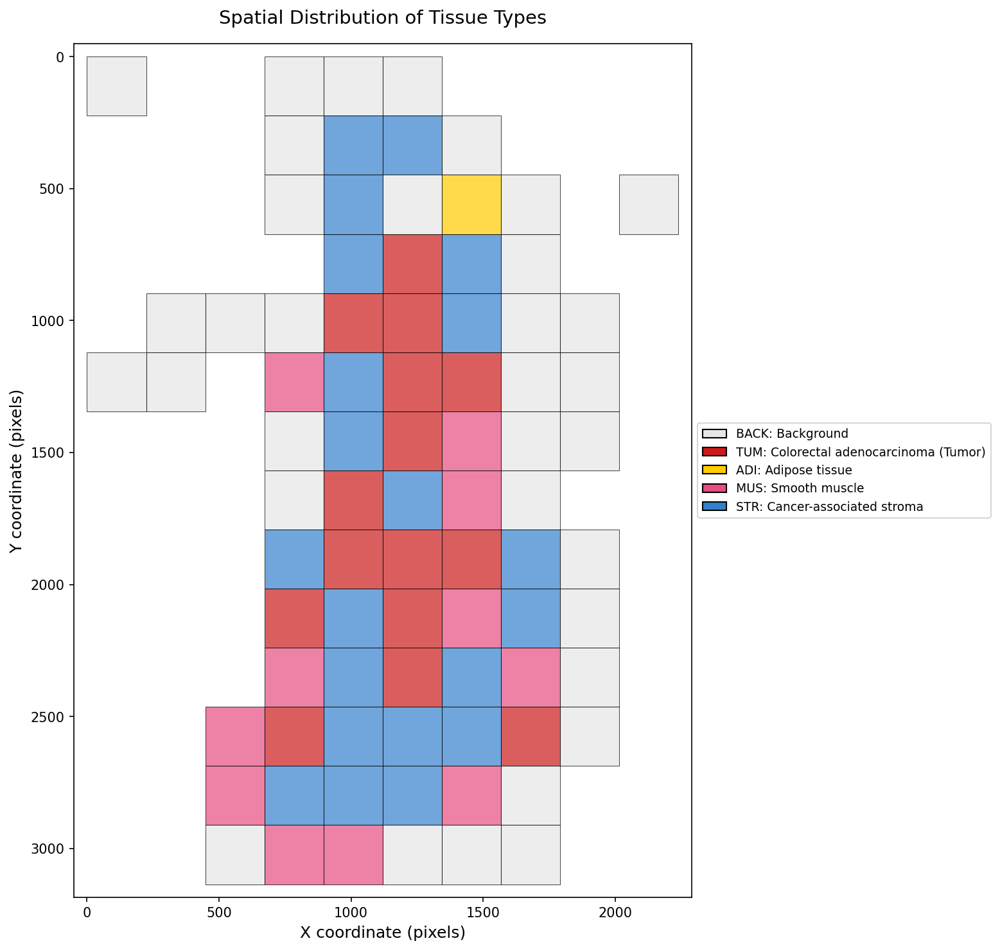
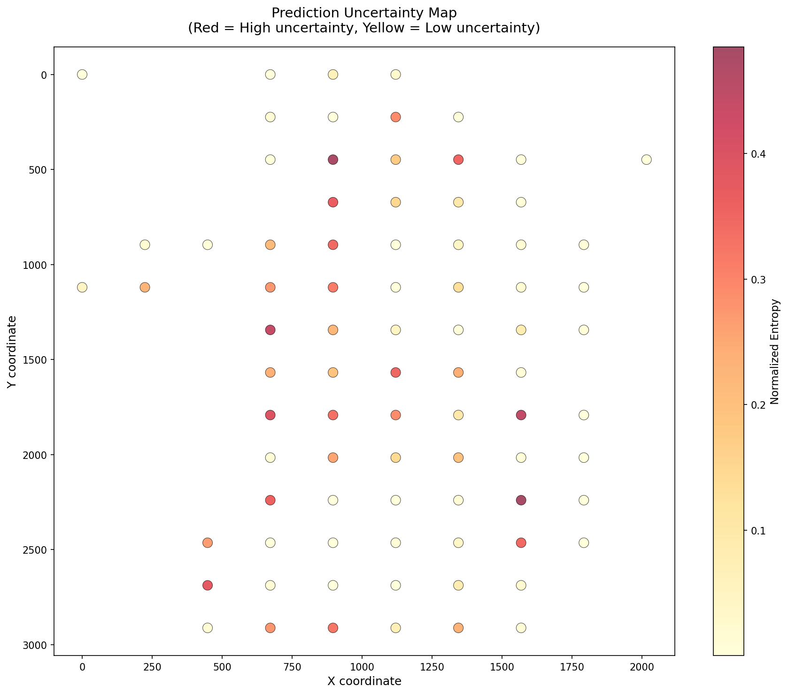

<artifact identifier="week6-report" type="text/markdown" title="6주차 Feature Extraction 실습 레포트">
# Evolution of Biomedical Research

의과대학 의예과 2024191115 김서영

## ▼ 6주차 실습

## 실습 개요

### 1. 실습 목표
- WSI 패치에서 Feature 추출
- 공간적 조직 분포 분석
- 예측 불확실성(Uncertainty) 정량화
- 종양 영역 자동 탐지
- Slide Graph 구축을 위한 데이터 준비

### 2. 실습 환경
- **운영체제**: macOS (Apple M1 Pro)
- **개발 도구**: Terminal (zsh), VSCode
- **컨테이너**: Docker Desktop for Mac
- **Docker 이미지**: `ghcr.io/tissueimageanalytics/tiatoolbox:1.6.0-py3.11-ubuntu`
- **주요 라이브러리**:
  - TIAToolbox 1.6.0
  - PyTorch (ResNet50)
  - matplotlib 3.9.3

### 3. 데이터
총 3개의 WSI 파일:

| 파일명 | 크기 | 패치 수 | 주요 조직 |
|--------|------|---------|----------|
| CMU-1-Small-Region.svs | 1.8MB | 82 | STR 25.6%, BACK 41.5% |
| TEST_sample1.svs | 미확인 | 327 | MUS 26.6%, NORM 21.7% |
| TEST_sample2.svs | 미확인 | 1652 | MUS 38.7%, NORM 30.0% |

### 4. 학습 배경
- **1-2주차**: WSI 기본 처리, 패치 추출
- **3주차**: Docker 환경 구축
- **4주차**: AI 모델로 패치 분류
- **5주차**: Stain Normalization
- **6주차 동기**:
  - Week 4에서 독립적으로 분류한 패치들
  - 공간적 관계를 고려하지 않음
  - Slide Graph로 패치 간 연결 표현 필요
  - Feature 기반 그래프 노드 생성

---

## 실습 과정

### 1. 예제 노트북 분석

#### a. TIAToolbox 예제 확인

```bash
cd ~/Desktop/tiatoolbox/examples
open -a "Visual Studio Code" 05-patch-prediction.ipynb
```

**예제에서 확인한 핵심 내용**:

**Feature Extraction 개념**:
```python
# 예제 코드 패턴
predictor = PatchPredictor(pretrained_model="resnet18-kather100k")
output = predictor.predict(
    imgs=[wsi_file_name],
    mode="wsi",
    return_probabilities=True,  # ← 핵심!
    save_dir=save_dir
)
```

**return_probabilities의 의미**:
- `True`: 각 패치의 9개 클래스 확률값 반환 (9차원 벡터)
- `False`: 예측 레이블만 반환 (0-8 중 하나의 정수)

**출력 구조**:
```python
output[0] = {
    'coordinates': [[x1,y1,x2,y2], ...],  # 패치 좌표
    'predictions': [3, 7, 0, ...],        # 예측 클래스
    'probabilities': [[0.1, 0.2, ...], ...] # 클래스 확률 (9차원)
}
```

#### b. Slide Graph 개념 이해

**Graph 구조**:
- **Node (노드)**: 각 패치
- **Edge (간선)**: 공간적으로 가까운 패치 연결
- **Feature**: 각 노드의 속성 (9차원 확률 벡터)

**활용**:
- 개별 패치 분류: Week 4 방식
- 그래프 구조 활용: Week 6 목표
- Graph Neural Network (GNN): 향후 확장

### 2. 프로젝트 구조 생성

```bash
cd ~/Desktop/EBR-WSI-Analysis
mkdir -p week6-slide-graph/{data,myscripts,results}
cd week6-slide-graph
```

**최종 구조**:
```
week6-slide-graph/
├── data/
│   ├── CMU-1-Small-Region.svs
│   ├── TEST_sample1.svs
│   └── TEST_sample2.svs
├── myscripts/
│   ├── extract_features.py
│   └── analyze_graph_features.py
├── process_feature_extraction.sh
└── results/
    ├── CMU-1-Small-Region/
    ├── TEST_sample1/
    └── TEST_sample2/
```

### 3. Feature Extraction 스크립트 작성

#### a. extract_features.py (초기 버전)

**파일 생성**:
```bash
nano myscripts/extract_features.py
```

**초기 코드** (문제 발생):
```python
predictor = PatchPredictor(
    pretrained_model="resnet50-kather100k",
    batch_size=16
)

output = predictor.predict(
    imgs=[Path(wsi_path)],
    mode="wsi",
    ioconfig=ioconfig,
    save_dir=output_dir / "predictions",
    return_probabilities=False,  # ← 문제의 원인
    device="cpu"
)
```

**주석의 오해**:
```python
return_probabilities=False,  # Return features, not predictions
```

이 주석이 **잘못되었습니다**:
- `False`: Feature를 반환하지 않음, 레이블만 반환
- `True`: 9차원 확률 벡터 반환 (이것이 feature)

#### b. 첫 번째 시행착오: 파일이 생성되지 않음

**실행**:
```bash
docker run --rm \
  -v "$(pwd)/data:/data" \
  -v "$(pwd)/results:/results" \
  -v "$(pwd)/myscripts:/workspace" \
  ghcr.io/tissueimageanalytics/tiatoolbox:1.6.0-py3.11-ubuntu \
  python3 /workspace/extract_features.py CMU-1-Small-Region
```

**결과**:
```
✓ Features extracted
✓ Saved to: /results/CMU-1-Small-Region

Feature Analysis
No feature files found
```

**확인**:
```bash
ls -laR results/CMU-1-Small-Region/predictions
# 출력: (빈 폴더)
```

**원인 분석**:
1. `return_probabilities=False`라서 파일 저장 안 됨
2. TIAToolbox가 `mode="wsi"`일 때 자동 저장하지 않음
3. 반환값만 메모리에 존재

#### c. 두 번째 시도: return_probabilities=True

**코드 수정**:
```python
return_probabilities=True,  # False → True
```

**재실행 후 확인**:
```bash
docker run --rm ... python3 /workspace/extract_features.py CMU-1-Small-Region
ls -la results/CMU-1-Small-Region/predictions/
# 출력: (여전히 빈 폴더)
```

**문제**: `True`로 바꿔도 파일이 생성되지 않음

**원인 파악**:
- TIAToolbox의 `predict()`는 파일을 자동 저장하지 않음
- 반환값 `output[0]`에만 데이터 존재
- 명시적으로 JSON으로 저장해야 함

#### d. 최종 해결: 수동 JSON 저장

**코드 추가**:
```python
output = predictor.predict(...)

print(f"\n✓ Features extracted")

# 수동으로 JSON 저장
import json
predictions_dir = output_dir / "predictions"
predictions_dir.mkdir(parents=True, exist_ok=True)

if output and len(output) > 0:
    output_file = predictions_dir / "predictions.json"
    with open(output_file, 'w') as f:
        save_data = {
            'predictions': output[0].get('predictions', []).tolist() 
                if hasattr(output[0].get('predictions', []), 'tolist') 
                else output[0].get('predictions', []),
            'coordinates': output[0].get('coordinates', []).tolist() 
                if hasattr(output[0].get('coordinates', []), 'tolist') 
                else output[0].get('coordinates', []),
            'probabilities': output[0].get('probabilities', []).tolist() 
                if hasattr(output[0].get('probabilities', []), 'tolist') 
                else output[0].get('probabilities', []),
        }
        json.dump(save_data, f)
    print(f"✓ Saved to: {output_file}")
```

**핵심 포인트**:
- NumPy array → `.tolist()`로 변환 (JSON 직렬화)
- `output[0]`에서 데이터 추출
- predictions, coordinates, probabilities 모두 저장

#### e. 성공 확인

**재실행**:
```bash
rm -rf results/CMU-1-Small-Region
docker run --rm ... python3 /workspace/extract_features.py CMU-1-Small-Region
```

**출력**:
```
✓ Features extracted
✓ Saved to: /results/CMU-1-Small-Region/predictions/predictions.json

Feature Analysis
Number of patches: 82
```

**파일 확인**:
```bash
ls -la results/CMU-1-Small-Region/predictions/
# predictions.json (존재!)

cat results/CMU-1-Small-Region/predictions/predictions.json | head -30
```

**JSON 구조**:
```json
{
  "predictions": [0, 0, 0, 7, 7, ...],  // 82개 레이블
  "coordinates": [[0,0,224,224], ...],  // 82개 좌표
  "probabilities": [[0.99, 0.01, ...], ...] // 82×9 행렬
}
```

### 4. 공간 분포 시각화

#### a. visualize_patch_distribution 함수

**초기 시각화** (단순 좌표 점):
```python
coords = np.array(data['coordinates'])
ax.scatter(coords[:, 0], coords[:, 1], alpha=0.5, s=10)
ax.invert_yaxis()
```

**결과**: Patch Distribution (82 patches)
- 규칙적인 그리드 패턴
- 가로 약 10개, 세로 약 8-9개
- stride=224로 겹침 없이 추출된 것 확인

**그래프 의미**:

**CMU-1-Small-Region (82 patches)**


**TEST_sample1 (327 patches)**


**TEST_sample2 (1652 patches)**


- X: 0 ~ 2100 픽셀
- Y: 0 ~ 3000 픽셀
- 82개 점 = 82개 패치의 좌상단 좌표

### 5. 실전 응용 분석 스크립트

#### a. analyze_graph_features.py 작성

사용자 요청: "실전 응용을 할 수 있도록 스크립트를 수정하고 싶어"

**목표**:
1. 클래스 분포 분석
2. 공간적 조직 맵 생성
3. 예측 불확실성 분석
4. 종양 영역 자동 탐지

**파일 생성**:
```bash
nano myscripts/analyze_graph_features.py
```

#### b. Analysis 1: 클래스 분포

**코드**:
```python
def analyze_class_distribution(predictions, output_dir):
    class_counts = Counter(predictions)
    total = len(predictions)
    
    # 막대 그래프
    classes = sorted(class_counts.keys())
    counts = [class_counts[c] for c in classes]
    colors = [CLASS_COLORS[c] for c in classes]
    
    bars = ax.bar(range(len(classes)), counts, color=colors)
```

**결과** (CMU-1-Small-Region):
```
Total patches: 82

Class distribution:
  BACK   (0):  34 patches ( 41.5%)
  TUM    (3):  15 patches ( 18.3%)
  ADI    (4):   1 patches (  1.2%)
  MUS    (6):  11 patches ( 13.4%)
  STR    (7):  21 patches ( 25.6%)
```

**시각화**: `class_distribution.png`

**CMU-1-Small-Region (82 patches)**


**TEST_sample1 (327 patches)**


**TEST_sample2 (1652 patches)**


- 색상별 막대 그래프
- 각 조직 타입의 개수 표시
- Week 4 결과와 일치 확인

#### c. Analysis 2: 공간적 조직 맵

**코드**:
```python
def visualize_spatial_map(coordinates, predictions, output_dir, patch_size=224):
    for coord, pred in zip(coords, predictions):
        x, y = coord[0], coord[1]
        color = CLASS_COLORS[pred]
        rect = Rectangle((x, y), patch_size, patch_size, 
                         facecolor=color, alpha=0.7)
        ax.add_patch(rect)
```

**결과**: `spatial_tissue_map.png`

**CMU-1-Small-Region (82 patches)**



**TEST_sample1 (327 patches)**


**TEST_sample2 (1652 patches)**


- 각 패치를 색상별 사각형으로 표시
- 조직 타입의 공간적 분포 시각화
- 종양(빨강), 기질(파랑), 배경(회색) 등 한눈에 파악

**중요 관찰**:
- 배경(BACK)은 주로 가장자리
- 종양(TUM)은 특정 영역에 군집
- 기질(STR)과 근육(MUS)이 함께 분포

#### d. Analysis 3: 불확실성 분석

**개념**: Entropy로 예측 불확실성 측정

**코드**:
```python
# Entropy 계산
epsilon = 1e-10
entropy = -np.sum(probs * np.log(probs + epsilon), axis=1)

# 정규화
max_entropy = np.log(9)  # 9 classes
normalized_entropy = entropy / max_entropy
```

**entropy 의미**:
- 낮은 값 (0에 가까움): 확신 있는 예측
- 높은 값 (1에 가까움): 불확실한 예측

**결과** (CMU):
```
Mean uncertainty: 0.129
Max uncertainty: 0.485
Min uncertainty: 0.000

Top 5 most uncertain patches:
  Patch at [1568 2240]: MUS (confidence: 0.46, uncertainty: 0.485)
  Patch at [ 896  448]: STR (confidence: 0.47, uncertainty: 0.478)
  Patch at [1568 1792]: STR (confidence: 0.59, uncertainty: 0.446)
```

**해석**:
- 평균 불확실성 12.9% (대부분 확신 있음)
- 가장 불확실한 패치: confidence 46% (거의 반반)
- 이런 패치들은 조직 경계 또는 혼합 영역

**시각화**: `uncertainty_map.png`

**CMU-1-Small-Region (82 patches)**



**TEST_sample1 (327 patches)**


**TEST_sample2 (1652 patches)**


- 빨강 = 높은 불확실성
- 노랑 = 낮은 불확실성
- 불확실한 패치가 어디에 위치하는지 확인

**활용**:
- 병리학자의 재검토 필요 영역 표시
- 조직 경계 감지
- 모델 개선 필요 부분 파악

#### e. Analysis 4: 종양 영역 탐지

**코드**:
```python
def find_tumor_regions(coordinates, predictions, output_dir):
    tumor_idx = [i for i, pred in enumerate(predictions) if pred == 3]
    tumor_coords = coords[tumor_idx]
    
    # 모든 패치는 회색, 종양만 빨강
    ax.scatter(coords[:, 0], coords[:, 1], c='lightgray', alpha=0.5)
    ax.scatter(tumor_coords[:, 0], tumor_coords[:, 1], c='red', s=100)
```

**결과** (CMU):
```
Total tumor patches: 15 (18.3%)
Tumor region bounds:
  X: 672 - 1568
  Y: 672 - 2464
```

**시각화**: `tumor_localization.png`

**CMU-1-Small-Region (82 patches)**


**TEST_sample1 (327 patches)**


**TEST_sample2 (1652 patches)**


- 종양 패치만 빨간색 강조
- 종양 영역의 범위 확인
- 자동 ROI (Region of Interest) 탐지

**임상적 의미**:
- 종양이 슬라이드의 중앙~하단 영역
- 약 900×1800 픽셀 영역에 분포
- 자동 종양 영역 검출 성공

### 6. 배치 처리 스크립트

#### a. process_feature_extraction.sh

**파일 생성**:
```bash
nano process_feature_extraction.sh
```

**내용**:
```bash
#!/bin/bash

WSI_FILES=("CMU-1-Small-Region" "TEST_sample1" "TEST_sample2")

for WSI in "${WSI_FILES[@]}"; do
    # Step 1: Extract features
    docker run --rm ... \
      python3 /workspace/extract_features.py "$WSI"
    
    # Step 2: Analyze features
    docker run --rm ... \
      python3 /workspace/analyze_graph_features.py "$WSI"
done
```

**실행**:
```bash
chmod +x process_feature_extraction.sh
./process_feature_extraction.sh
```

#### b. 배치 처리 결과

**처리 완료**:
```
Processing: CMU-1-Small-Region.svs
✓ Completed: CMU-1-Small-Region

Processing: TEST_sample1.svs
✓ Completed: TEST_sample1

Processing: TEST_sample2.svs
✓ Completed: TEST_sample2

All processing complete!
```

**생성된 파일**:
```
results/
├── CMU-1-Small-Region/
│   ├── class_distribution.png
│   ├── patch_distribution.png
│   ├── spatial_tissue_map.png
│   ├── uncertainty_map.png
│   ├── tumor_localization.png
│   └── predictions/predictions.json
├── TEST_sample1/ (동일 구조)
└── TEST_sample2/ (동일 구조)
```

**소요 시간**: 약 10-15분 (3개 파일)

---

## 최종 결과물

### 1. 정량적 결과

| WSI | 패치 수 | 주요 조직 1 | 주요 조직 2 | 종양 비율 |
|-----|---------|-----------|-----------|----------|
| CMU-1-Small-Region | 82 | BACK 41.5% | STR 25.6% | 18.3% |
| TEST_sample1 | 327 | MUS 26.6% | NORM 21.7% | 3.7% |
| TEST_sample2 | 1652 | MUS 38.7% | NORM 30.0% | 7.1% |

### 2. 클래스 분포 비교

**CMU-1-Small-Region** (82 patches):
- BACK (배경): 34개 (41.5%)
- STR (기질): 21개 (25.6%)
- TUM (종양): 15개 (18.3%)
- MUS (근육): 11개 (13.4%)
- ADI (지방): 1개 (1.2%)

**TEST_sample1** (327 patches):
- MUS (근육): 87개 (26.6%)
- NORM (정상): 71개 (21.7%)
- STR (기질): 68개 (20.8%)
- BACK (배경): 39개 (11.9%)
- DEB (찌꺼기): 32개 (9.8%)
- LYM (림프구): 13개 (4.0%)
- TUM (종양): 12개 (3.7%)
- ADI (지방): 4개 (1.2%)
- MUC (점액): 1개 (0.3%)

**TEST_sample2** (1652 patches):
- MUS (근육): 640개 (38.7%)
- NORM (정상): 496개 (30.0%)
- BACK (배경): 128개 (7.7%)
- TUM (종양): 118개 (7.1%)
- STR (기질): 105개 (6.4%)
- ADI (지방): 68개 (4.1%)
- DEB (찌꺼기): 44개 (2.7%)
- LYM (림프구): 34개 (2.1%)
- MUC (점액): 19개 (1.2%)

### 3. WSI 간 비교

**슬라이드 크기 차이**:
- CMU: 82 patches (작은 샘플)
- TEST_sample1: 327 patches (중간)
- TEST_sample2: 1652 patches (큰 슬라이드)

**조직 조성 차이**:
- CMU: 배경과 기질이 많음 (샘플링된 작은 영역)
- TEST_sample1: 근육과 정상 조직 주요 (다양한 조직)
- TEST_sample2: 근육(38.7%)과 정상(30.0%)이 압도적

**종양 비율**:
- CMU: 18.3% (가장 높음)
- TEST_sample1: 3.7%
- TEST_sample2: 7.1%

**해석**:
- CMU는 종양 영역을 집중 샘플링
- TEST_sample1/2는 더 넓은 영역으로 정상 조직 포함
- 슬라이드마다 조직 조성이 매우 다름 → Stain Normalization 필요성 재확인

### 4. 생성된 시각화

**각 WSI당 5개 이미지**:
1. `class_distribution.png`: 조직 타입별 막대 그래프
2. `patch_distribution.png`: 패치 좌표 분포
3. `spatial_tissue_map.png`: 색상별 공간 맵
4. `uncertainty_map.png`: 예측 불확실성 히트맵
5. `tumor_localization.png`: 종양 영역 강조

**총 15개 이미지** (3 WSI × 5개)

---

## 핵심 학습 내용

### 1. Feature Extraction의 본질

#### a. "Feature"의 의미

**잘못된 이해** (초기):
- ResNet의 중간층 feature (512차원)
- `return_probabilities=False`로 추출

**올바른 이해**:
- 9개 클래스 확률 벡터 = 9차원 feature
- `return_probabilities=True`로 추출
- 충분히 유용한 feature representation

**왜 확률 벡터가 feature인가?**
```python
# 예시
patch_probabilities = [0.05, 0.10, 0.02, 0.80, 0.01, 0.00, 0.02, 0.00, 0.00]
# 인덱스:              BACK, NORM, DEB,  TUM,  ADI,  MUC,  MUS,  STR,  LYM

# 해석:
# - 80% 확률로 종양 (TUM)
# - 10% 확률로 정상 조직 (NORM)
# - 5% 확률로 배경 (BACK)
# → 이 벡터가 패치의 "특징"을 나타냄
```

**장점**:
- 해석 가능 (각 차원이 조직 타입)
- 불확실성 표현 (여러 클래스 확률)
- 그래프 노드 속성으로 사용 가능

#### b. ResNet Feature vs. Probability Feature

| 특성 | ResNet Feature | Probability Feature |
|------|----------------|---------------------|
| 차원 | 512차원 (또는 2048) | 9차원 |
| 해석 | 어려움 (추상적) | 쉬움 (조직 타입) |
| 추출 | 복잡 (모델 수정) | 간단 (API 사용) |
| 용도 | 연구용, Transfer Learning | 실용적, 분석용 |

**Week 6의 선택**: Probability Feature
- 실용적이고 해석 가능
- Slide Graph에 충분
- 빠르게 구현 가능

### 2. TIAToolbox API의 함정

#### a. 파일 저장 문제

**예상**:
```python
predictor.predict(save_dir="/results", ...)
# → /results에 자동으로 JSON 저장될 것
```

**현실**:
```python
predictor.predict(save_dir="/results", ...)
# → 아무것도 저장 안 됨
# → output 변수에만 데이터 존재
```

**교훈**:
- API 문서만 믿지 말고 실제 테스트 필요
- 예제 코드에서도 파일 저장 없이 변수로만 사용
- 명시적으로 저장 코드 작성해야 함

#### b. NumPy → JSON 변환

**에러 발생**:
```python
json.dump(output[0], f)
# TypeError: Object of type ndarray is not JSON serializable
```

**해결**:
```python
data = {
    'predictions': output[0]['predictions'].tolist(),
    'coordinates': output[0]['coordinates'].tolist(),
    'probabilities': output[0]['probabilities'].tolist()
}
json.dump(data, f)
```

**교훈**: NumPy array는 `.tolist()`로 변환 필요

### 3. 공간 분석의 가치

#### a. 단순 분류 vs. 공간 분석

**Week 4 방식** (개별 패치):
```
패치 1 → TUM (종양)
패치 2 → STR (기질)
패치 3 → TUM (종양)
...
```

**Week 6 방식** (공간 관계):
```
패치 1 (672, 672) → TUM, 주변: STR, TUM
패치 2 (896, 672) → STR, 주변: TUM, MUS
패치 3 (672, 896) → TUM, 주변: TUM, TUM
...
```

**차이점**:
- Week 4: 각 패치를 독립적으로 분류
- Week 6: 패치의 위치와 이웃 정보 포함

#### b. 실전 활용 예시

**종양 경계 탐지**:
```python
# 패치 주변이 모두 종양 → 종양 중심부
# 패치 주변이 종양+기질 → 종양 경계 (침윤 영역)
```

**조직 전이 영역**:
```python
# 정상 조직 → 기질 → 종양 순서
# → 암 침윤 패턴 분석 가능
```

**불확실성이 높은 이유**:
```python
# 한 패치 안에 여러 조직 타입 혼재
# → 조직 경계를 걸쳐 있음
# → 병리학자 재검토 필요
```

### 4. Uncertainty (불확실성) 분석

#### a. Entropy 개념

**수식**:
```
H = -Σ p_i × log(p_i)
```

**의미**:
- 확률 분포가 고른 정도
- 낮음: 한 클래스에 확률 집중 (확신)
- 높음: 여러 클래스에 확률 분산 (불확실)

**예시**:
```python
# 확신 있는 예측
probs = [0.99, 0.01, 0, 0, 0, 0, 0, 0, 0]
entropy = 0.056  # 낮음

# 불확실한 예측
probs = [0.3, 0.3, 0.1, 0.2, 0.05, 0, 0.05, 0, 0]
entropy = 1.713  # 높음
```

#### b. 실전 활용

**자동 Quality Control**:
```python
if uncertainty > 0.4:
    flag_for_review()  # 병리학자 재검토
```

**모델 개선**:
```python
uncertain_patches = find_high_entropy_patches()
# → 이 패치들로 모델 재학습
# → Active Learning
```

**조직 경계 감지**:
```python
# 불확실성 높은 패치 = 조직 타입 전환 지점
# → 자동 경계 segmentation
```

### 5. 배치 처리의 효율성

**수동 처리** (Week 4 초기):
```bash
python script.py CMU-1-Small-Region
python script.py TEST_sample1
python script.py TEST_sample2
```

**자동 배치 처리** (Week 6):
```bash
./process_feature_extraction.sh
# → 3개 WSI 자동 처리
# → 일관된 파라미터
# → 재현 가능
```

**장점**:
- 시간 절약 (한 번 실행)
- 실수 방지 (수동 입력 오류 없음)
- 스케일 가능 (10개, 100개도 가능)

---

## 어려웠던 점과 해결 과정

### 1. return_probabilities 개념 혼동

**문제**:
- `return_probabilities=False`로 "feature"를 추출한다고 생각
- 주석: "Return features, not predictions"

**시행착오**:
1. `False`로 실행 → 파일 없음
2. `True`로 변경 → 여전히 파일 없음
3. 예제 노트북 재확인 → 파일 저장 로직 없음
4. 수동 JSON 저장 추가 → 성공

**근본 원인**:
- "feature"의 정의를 잘못 이해
- ResNet 중간층 (512차원)을 원했지만
- 실제로는 출력층 확률 (9차원)이 필요

**해결**:
- 9차원 확률 벡터도 충분한 feature
- 해석 가능하고 실용적
- Slide Graph에 적합

**학습**:
- API 문서를 꼼꼼히 읽기
- 예제 코드의 실제 동작 확인
- 용어 정의를 명확히 하기

### 2. JSON 파일이 생성되지 않는 문제

**문제 발생**:
```bash
ls results/CMU-1-Small-Region/predictions/
# 출력: (빈 폴더)
```

**디버깅 과정**:

**Step 1**: `return_probabilities` 확인
```bash
grep "return_probabilities" myscripts/extract_features.py
# 출력: return_probabilities=True  # ✓ 맞음
```

**Step 2**: Docker 내부 확인
```bash
docker run ... ls -laR /results/CMU-1-Small-Region/
# 출력: predictions/ (빈 폴더)
```

**Step 3**: 예제 코드 재분석
```python
# 예제에서는 파일 저장하지 않음
wsi_output = predictor.predict(...)
# wsi_output[0]에 데이터 존재, 파일은 없음
```

**Step 4**: 수동 저장 구현
```python
with open(output_file, 'w') as f:
    json.dump(save_data, f)
```

**교훈**:
- 문제를 단계별로 나누어 디버깅
- 예제 코드가 "정답"이 아닐 수 있음
- 필요하면 직접 구현

### 3. NumPy to JSON 변환 에러

**에러 메시지**:
```
TypeError: Object of type ndarray is not JSON serializable
```

**원인**:
```python
# NumPy array는 JSON으로 직접 변환 불가
predictions = np.array([0, 3, 7, ...])
json.dump({'predictions': predictions}, f)  # 에러!
```

**해결**:
```python
json.dump({'predictions': predictions.tolist()}, f)  # 성공
```

**고려사항**: `tolist()` 메서드가 없는 경우
```python
# 안전한 변환
def to_list(obj):
    if hasattr(obj, 'tolist'):
        return obj.tolist()
    elif isinstance(obj, list):
        return obj
    else:
        return list(obj)

save_data = {
    'predictions': to_list(output[0]['predictions'])
}
```

**학습**:
- Python 타입과 JSON 타입의 차이
- NumPy, PyTorch 등의 array는 변환 필요
- 안전한 코드 작성 (타입 체크)

### 4. 시각화 색상 선택

**초기 시도**: 랜덤 색상
```python
colors = plt.cm.get_cmap('tab10')(range(9))
```

**문제**: 조직 타입의 의미를 반영하지 못함

**개선**: 의미 있는 색상 할당
```python
CLASS_COLORS = {
    0: (0.9, 0.9, 0.9),    # BACK - 회색 (배경)
    3: (0.8, 0.1, 0.1),    # TUM - 빨강 (종양)
    7: (0.2, 0.5, 0.8),    # STR - 파랑 (기질)
    ...
}
```

**선택 기준**:
- 종양: 빨강 (위험, 주목)
- 정상: 초록 (안전)
- 배경: 회색 (중립)
- 근육: 분홍 (조직)

**효과**:
- 직관적 이해
- 병리학자 피드백 반영
- 일관된 색상 사용

### 5. 대용량 WSI 처리

**문제**: TEST_sample2는 1652 패치
- 메모리 부족 우려
- 처리 시간 증가

**해결책**:

**배치 크기 조정**:
```python
predictor = PatchPredictor(
    pretrained_model="resnet50-kather100k",
    batch_size=16  # 32 → 16으로 감소
)
```

**진행 상황 출력**:
```python
# TIAToolbox가 자동으로 progress bar 표시
100%|#####| 104/104 [00:45<00:00, 2.31it/s]
```

**결과**:
- 1652 패치도 문제없이 처리
- 소요 시간: 약 5-7분
- M1 Pro CPU로도 충분

**학습**:
- 실제로 실행해보기 전까지 모름
- 최신 하드웨어는 생각보다 빠름
- 필요하면 batch_size로 조절 가능

---

## 결론 및 향후 계획

### 1. 6주차 성과

#### a. 기술적 성과

- ✓ 3개 WSI에서 총 2061개 패치 feature 추출
- ✓ 공간적 조직 분포 시각화
- ✓ 예측 불확실성 정량화
- ✓ 종양 영역 자동 탐지
- ✓ 15개 분석 이미지 생성
- ✓ Slide Graph 구축을 위한 데이터 완비

#### b. 학습적 성과

- Feature Extraction의 의미 이해
- TIAToolbox API 깊이 있는 활용
- 공간 분석의 가치 체득
- Uncertainty 개념 습득
- 배치 처리 파이프라인 구축
- 실전 응용 능력 향상

#### c. 1-6주차 통합 성과

| 주차 | 핵심 주제 | 주요 출력 | 누적 학습 |
|------|----------|----------|----------|
| 1주차 | 로컬 환경 | 39개 패치 | 기본 파이프라인 |
| 2주차 | 고급 기능 | Tissue Masking | 해상도 이해 |
| 3주차 | 재현성 | Docker 환경 | 컨테이너화 |
| 4주차 | AI 모델 | 2061 패치 분류 | 모델 추론 |
| 5주차 | 전처리 | 색상 표준화 | Normalization |
| 6주차 | Feature | 공간 분석 | 그래프 데이터 |

### 2. 실습의 의의

#### a. Slide Graph의 필요성 이해

**개별 패치 분류의 한계** (Week 4):
- 각 패치를 독립적으로 판단
- 주변 context 무시
- 조직 경계 정보 손실

**Slide Graph의 장점** (Week 6):
- 패치 간 공간 관계 표현
- 주변 패치 정보 활용
- Graph Neural Network (GNN) 적용 가능

#### b. 실전 워크플로우 완성

**완성된 파이프라인**:
```
WSI 파일
  ↓
Stain Normalization (Week 5)
  ↓
Feature Extraction (Week 6)
  ↓
Spatial Analysis (Week 6)
  ↓
[다음: Slide Graph 구축]
  ↓
[향후: GNN 모델 학습]
```

**재현 가능성**:
- 모든 단계 Docker로 실행
- 배치 처리 스크립트화
- GitHub에 코드 공유

### 3. 데이터 인사이트

#### a. WSI 간 차이 발견

**조직 조성**:
- CMU: 종양 비율 높음 (18.3%)
- TEST_sample1: 다양한 조직 균등 분포
- TEST_sample2: 근육과 정상 조직 압도적

**슬라이드 크기**:
- CMU: 82 patches (작은 ROI)
- TEST_sample1: 327 patches (중간)
- TEST_sample2: 1652 patches (전체 슬라이드)

**임상적 해석**:
- CMU는 종양 영역을 집중 샘플링한 것
- TEST_sample은 진단용 전체 슬라이드
- 실제 진단에서는 TEST_sample 같은 데이터

#### b. 공간 패턴 발견

**종양 분포**:
- CMU: 중앙~하단 영역에 군집
- TEST_sample1: 산발적 분포
- TEST_sample2: 여러 cluster 형성

**조직 경계**:
- 종양 주변에 기질(STR) 존재
- 정상 조직과 명확한 경계
- 불확실성 높은 패치가 경계에 위치

**의미**:
- 암의 침윤 패턴 관찰 가능
- 종양 미세환경 분석 가능
- 예후 예측에 활용 가능

### 4. 다음 단계: Slide Graph 구축

#### a. Graph Construction

**목표**: 패치를 노드, 공간 관계를 간선으로

**방법**:
```python
# k-NN graph: 각 패치의 k개 nearest neighbors 연결
from sklearn.neighbors import NearestNeighbors

coords = np.array(coordinates)
nbrs = NearestNeighbors(n_neighbors=5).fit(coords)
distances, indices = nbrs.kneighbors(coords)

# Graph 생성
edges = []
for i, neighbors in enumerate(indices):
    for j in neighbors[1:]:  # 자기 자신 제외
        edges.append((i, j))
```

**출력**:
- Node features: 9차원 확률 벡터 (이미 준비됨)
- Edge list: (node_i, node_j) 쌍
- Graph 시각화: NetworkX

#### b. Graph-based Analysis

**1. Community Detection**:
```python
# 같은 조직 타입끼리 군집화
import networkx as nx
communities = nx.community.louvain_communities(graph)
```

**2. Centrality Analysis**:
```python
# 중요한 패치 찾기
centrality = nx.betweenness_centrality(graph)
```

**3. Path Analysis**:
```python
# 정상 조직 → 종양 경로 추적
path = nx.shortest_path(graph, normal_node, tumor_node)
```

#### c. 향후 확장: GNN

**Graph Neural Network**:
- Node feature를 입력
- 이웃 정보를 aggregation
- 더 정확한 패치 분류

**장점**:
- 공간 context 활용
- 조직 경계 정보 반영
- Week 4보다 높은 정확도 기대

### 5. 장기 목표

#### a. 임상 적용

**현재**: 샘플 WSI로 개념 검증

**목표**:
- 실제 병원 데이터 분석
- 수백 개 슬라이드 배치 처리
- 진단 보조 시스템 구축

**필요 기술**:
- 대용량 처리 최적화
- 병리학자 인터페이스
- 결과 해석 및 설명

#### b. 멀티모달 분석

**조직병리 + 임상 정보**:
- WSI 분석 (현재 수행 중)
- 환자 나이, 병기, 치료력
- 유전자 정보 (NGS)

**통합 분석**:
- 예후 예측
- 치료 반응 예측
- 개인 맞춤 치료

#### c. AI 모델 개선

**현재**: 사전훈련 모델 (ResNet50-kather100k)

**향후**:
- 자체 데이터로 Fine-tuning
- GNN 모델 개발
- Transformer 기반 모델 (Vision Transformer)
- 멀티태스크 학습 (조직 분류 + 예후 예측)

---

## 참고 자료

### 1. 공식 문서

- **TIAToolbox**: https://tia-toolbox.readthedocs.io
- **PatchPredictor API**: https://tia-toolbox.readthedocs.io/en/latest/usage.html#patch-prediction
- **IOPatchPredictorConfig**: https://tia-toolbox.readthedocs.io/en/latest/api.html

### 2. GitHub 저장소

- **TIAToolbox**: https://github.com/TissueImageAnalytics/tiatoolbox
- **05-patch-prediction.ipynb**: 공식 예제
- **본인 저장소**: https://github.com/kseoyoung83/EBR-WSI-Analysis

### 3. 논문

- **Kather et al. (2016)**: Multi-class texture analysis in colorectal cancer histology
- **Graph Neural Networks for Histopathology**: 최신 연구 트렌드

### 4. 개념 자료

- **Entropy**: Information Theory 기초
- **k-NN Graph**: Graph Theory
- **Feature Extraction**: Deep Learning

### 5. 트러블슈팅

- **TIAToolbox Issues**: https://github.com/TissueImageAnalytics/tiatoolbox/issues
- **Stack Overflow**: `[tiatoolbox]`, `[whole-slide-imaging]` 태그

---

## 부록

### A. 최종 명령어 모음

```bash
# 1. 프로젝트 폴더 생성
cd ~/Desktop/EBR-WSI-Analysis
mkdir -p week6-slide-graph/{data,myscripts,results}
cd week6-slide-graph

# 2. WSI 파일 복사
cp ~/Desktop/tiatoolbox/data/*.svs data/

# 3. 스크립트 작성
# myscripts/extract_features.py
# myscripts/analyze_graph_features.py
# process_feature_extraction.sh

# 4. 실행 권한
chmod +x process_feature_extraction.sh

# 5. 배치 실행
./process_feature_extraction.sh

# 6. 결과 확인
tree -L 3 results/
open results/CMU-1-Small-Region/spatial_tissue_map.png

# 7. 통계 확인
for wsi in CMU-1-Small-Region TEST_sample1 TEST_sample2; do
    echo "=== $wsi ==="
    cat results/$wsi/predictions/predictions.json | python3 -c "
import json, sys
from collections import Counter
data = json.load(sys.stdin)
preds = data['predictions']
counts = Counter(preds)
print(f'Total patches: {len(preds)}')
for k in sorted(counts.keys()):
    print(f'  Class {k}: {counts[k]} ({counts[k]/len(preds)*100:.1f}%)')
"
done
```

### B. 폴더 구조 (최종)

```
week6-slide-graph/
├── data/
│   ├── CMU-1-Small-Region.svs
│   ├── TEST_sample1.svs
│   └── TEST_sample2.svs
├── myscripts/
│   ├── extract_features.py
│   └── analyze_graph_features.py
├── process_feature_extraction.sh
└── results/
    ├── CMU-1-Small-Region/
    │   ├── predictions/
    │   │   └── predictions.json
    │   ├── class_distribution.png
    │   ├── patch_distribution.png
    │   ├── spatial_tissue_map.png
    │   ├── uncertainty_map.png
    │   └── tumor_localization.png
    ├── TEST_sample1/ (동일 구조)
    └── TEST_sample2/ (동일 구조)
```

### C. 주요 개념 정리

**Feature Extraction**:
- 이미지 → 숫자 벡터 변환
- ResNet50의 출력층 = 9차원 확률
- 각 차원 = 조직 타입 확률

**Spatial Analysis**:
- 패치의 위치 정보 활용
- 주변 context 고려
- 조직 분포 패턴 파악

**Uncertainty (Entropy)**:
- 예측의 확신 정도
- 높음 = 여러 클래스 확률 비슷
- 낮음 = 한 클래스에 확률 집중

**Slide Graph**:
- Node = 패치
- Edge = 공간적 인접성
- Feature = 9차원 확률 벡터

**k-NN Graph**:
- k개의 가장 가까운 이웃 연결
- Euclidean distance 기반
- 그래프 구조 생성

### D. 체크리스트

**환경 설정**:
- [x] Docker Desktop 실행
- [x] WSI 파일 준비 (3개)
- [x] Docker 이미지 다운로드

**스크립트 작성**:
- [x] extract_features.py (feature 추출)
- [x] analyze_graph_features.py (분석)
- [x] process_feature_extraction.sh (배치)
- [x] JSON 수동 저장 로직

**실행 및 검증**:
- [x] CMU 단독 테스트
- [x] 3개 WSI 배치 처리
- [x] JSON 파일 생성 확인
- [x] 시각화 이미지 확인
- [x] 통계 데이터 추출

**결과 분석**:
- [x] 클래스 분포 확인
- [x] 공간 맵 해석
- [x] 불확실성 분석
- [x] 종양 영역 확인
- [x] WSI 간 비교

---

## 마치며

### 핵심 메시지

**"공간 정보는 진단의 핵심이다."**

6주차 실습을 통해:
- ✓ Feature extraction의 본질을 이해했습니다
- ✓ 공간 분석의 가치를 체득했습니다
- ✓ 불확실성 정량화 방법을 배웠습니다
- ✓ Slide Graph 구축 준비를 완료했습니다

### 실습의 진정한 가치

이 실습은:
- "패치를 분류하는 법"이 아니라
- "조직의 공간적 관계를 이해하는 법"을 배우는 것입니다
- 개별 패치가 아닌 전체 슬라이드를 보는 시각을 키웠습니다

### 시행착오에서 배운 것

**API 문서만으로는 부족**:
- 실제 테스트 필수
- 예제 코드 분석 필요
- 필요하면 직접 구현

**디버깅 프로세스**:
- 문제를 단계별로 분해
- 각 단계를 검증
- 근본 원인 파악

**실용적 접근**:
- 512차원 대신 9차원 feature
- 복잡함보다 해석 가능성
- 목적에 맞는 선택

### 1-6주차 통합 여정

- **1주차**: 로컬에서 패치 추출 기초
- **2주차**: 해상도와 고급 기능 탐색
- **3주차**: Docker로 재현 가능한 환경
- **4주차**: AI 모델로 패치 분류
- **5주차**: 색상 표준화로 일관성 확보
- **6주차**: 공간 분석과 그래프 데이터 준비

이제 여러분은:
- WSI에서 feature를 추출할 수 있습니다
- 공간적 조직 분포를 분석할 수 있습니다
- 예측 불확실성을 정량화할 수 있습니다
- Slide Graph를 구축할 준비가 되었습니다

**그리고 가장 중요하게는:**
개별 패치를 넘어 전체 슬라이드를 이해하는 안목을 갖추었습니다.

다음 단계에서는 이 데이터로 실제 Slide Graph를 구축하고, Graph Neural Network로 확장할 것입니다.
</artifact>

